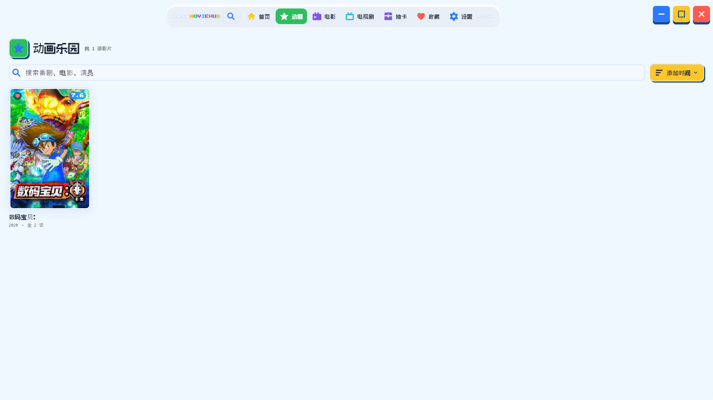

# MovieHub

MovieHub 是一款面向 Windows 的本地私人影视库应用。它直接读取电脑中的电影、动画和电视剧文件，自动整理为海报墙，记录观看进度，并提供内置播放器；不需要部署服务器、NAS 或 Docker。

> 当前版本：以 [`pubspec.yaml`](pubspec.yaml) 的 `version` 字段为准
> 目标平台：Windows 10/11 桌面端

## 功能截图

### 首页


### 动画



### 设置


## 主要功能

- 本地媒体库
  - 添加一个或多个本地影视目录。
  - 扫描 `mp4`、`mkv`、`avi`、`mov`、`flv`、`ts`、`m2ts` 等常见视频文件。
  - 使用 SQLite 将媒体索引、刮削结果、收藏状态和观看进度保存到本机。
  - 重新扫描时尽量保留已有资料和播放记录。

- 电影、动画与电视剧整理
  - 根据文件名识别电影和剧集。
  - 支持 `S01E01`、`1x01` 等常见剧集命名格式。
  - 自动将电视剧按剧集归组，并在详情页按季、集浏览。
  - 首页提供继续观看、最近加入、动画、电影、电视剧和收藏入口。

- TMDB 资料刮削
  - 使用 TMDB 获取片名、海报、背景图、简介、评分、类型、导演、演员和片长。
  - 支持单项匹配、剧集整组匹配、批量匹配和手动搜索匹配。
  - 海报和背景图会缓存在本机，后续浏览无需重复下载。
  - 支持配置 TMDB 访问代理，适合需要本机代理访问 TMDB 的网络环境。

- 内置本地播放器
  - 基于 `media_kit` 播放本地视频。
  - 支持暂停、进度拖动、音量、倍速、截图、全屏、字幕/音轨切换和自动下一集。
  - 自动保存播放进度，未看完的内容会出现在首页“继续观看”中。
  - 支持默认字幕偏好设置。

- 个性化与系统集成
  - 支持深色、浅色和跟随系统主题。
  - 支持自定义本地背景图片。
  - 支持 Windows 登录后自动启动。
  - 设置页可管理媒体目录、刮削配置、播放偏好、外观和关于信息。

## 首次使用

1. 启动应用后进入左侧导航的“设置”。
2. 在“媒体库”中点击“添加目录”，选择本地影视文件夹。
3. 点击“重新扫描”，等待视频出现在首页或对应分类中。
4. 如需补全海报和影片资料，在“刮削”中填写 TMDB Read Access Token。
5. 点击“匹配未刮削条目”，或在单个条目详情页手动匹配。
6. 点击海报进入详情页；电影可直接播放，电视剧可选择具体集数播放。

## TMDB 配置

MovieHub 不内置 TMDB 凭据。请自行在 [TMDB API 设置](https://www.themoviedb.org/settings/api) 创建并使用 **API Read Access Token**。

在应用内依次打开“设置” -> “刮削”，填写令牌并保存即可。令牌仅保存于当前 Windows 用户的本地应用数据目录，不会写入源代码或 Git 仓库。

如果 TMDB 请求超时，而浏览器已通过代理正常访问 TMDB，可在同一页面填写本机代理，例如：

```text
127.0.0.1:7890
```

请确认代理软件开启了本地 HTTP 代理端口；仅能在浏览器中访问并不一定代表桌面应用会自动使用该代理。

## 本地数据与隐私

Windows 下，应用数据默认保存在：

```text
%APPDATA%\MovieHub
```

其中包含媒体库 SQLite 数据库、TMDB 设置和图片缓存。播放器截图默认保存到：

```text
%USERPROFILE%\Pictures\MovieHub
```

MovieHub 的媒体索引、观看记录、收藏、TMDB 令牌和图片缓存均保存在本机。仅在你主动使用 TMDB 刮削或下载海报/背景图时，应用才会与 TMDB 通信。

删除应用程序不会自动删除这些个人数据；需要重置资料时可手动删除上述 `MovieHub` 数据目录。

## 安装与发布

如果你只是使用 MovieHub，请下载 Release 页面中的 Windows 安装包并运行。

如果系统提示未知发布者，是因为当前版本暂未进行代码签名；确认安装包来源可信后可选择继续运行。

## 开发环境

- Flutter stable，需包含 Dart `3.12.2` 或兼容版本
- Windows 10/11
- Visual Studio Community / Build Tools，并安装“使用 C++ 的桌面开发”工作负载
  - MSVC C++ x64/x86 生成工具
  - Windows SDK
  - CMake Tools for Windows

检查环境：

```powershell
flutter doctor
```

安装依赖并以 Windows 桌面端启动：

```powershell
flutter pub get
flutter run -d windows
```

常用质量检查：

```powershell
dart format lib test
dart analyze
flutter test
```

## 打包发布

构建 Windows Release：

```powershell
flutter build windows --release
```

生成文件位于：

```text
build\windows\x64\runner\Release
```

分发时请复制整个 `Release` 文件夹，不能只复制 `moviehub.exe`，因为播放器和 Flutter 运行时依赖其中的 DLL 文件。

项目提供 Inno Setup 安装脚本：

```text
installer\MovieHub.iss
```

应用版本统一在 `pubspec.yaml` 的 `version` 字段维护。Windows 和 Android
构建版本、应用内“关于”信息及 Windows 安装包版本都会从这里读取，无需在其他文件中重复修改。

构建 Release 后，可使用 Inno Setup 打开该脚本并编译安装包。默认输出文件名为：

```text
installer\MovieHub-<version>-setup.exe
```

## 当前限制与后续方向

- 目前只支持 Windows，本地媒体库不提供局域网或云端同步。
- 扫描需要手动触发，尚未实现目录实时监控。
- 已支持的本地视频格式以扫描器列表为准，暂不支持 ISO。
- AI 推荐、自动下载字幕、Trakt/豆瓣同步、Jellyfin/Plex 导入和移动端同步仍属于后续规划。

## 技术栈

- Flutter / Dart
- SQLite
- media_kit（基于 libmpv）
- TMDB API
- Inno Setup

## 致谢

- 感谢 [TMDB](https://www.themoviedb.org/) 提供影视资料数据服务。
- 感谢 [Linux.do](https://linux.do/) 社区提供交流、反馈和推广支持。

### 字体致谢

本项目使用以下开源字体为像素风格界面提供支持：

- 感谢 TakWolf 开源的 [Ark Pixel Font](https://github.com/TakWolf/ark-pixel-font)，为应用提供中文像素字体（Apache License 2.0）。
- 感谢 Cody "CodeMan38" Boisclair 创作的 [Press Start 2P](https://fonts.google.com/specimen/Press+Start+2P)，为应用提供英文字母与数字像素字体（SIL Open Font License 1.1）。
- 感谢 SolidZORO 开源的 [Zpix](https://github.com/SolidZORO/zpix-pixel-font)，为应用提供像素标签字体（Free for commercial and personal use）。

本项目与 TMDB 官方无隶属关系，TMDB 相关数据和图片版权归其原始权利方所有。
